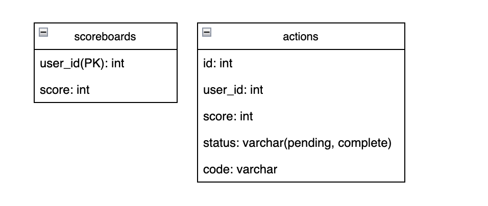
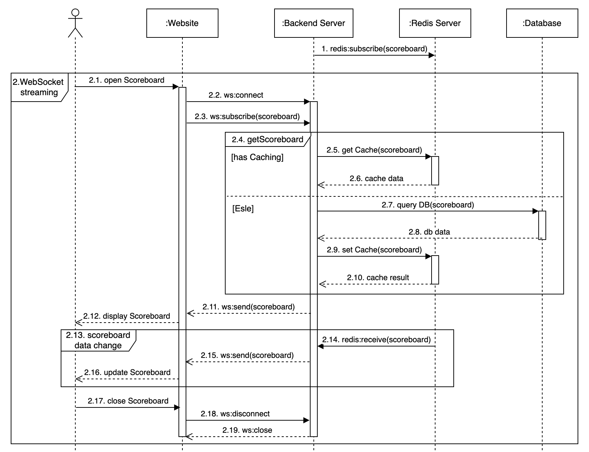
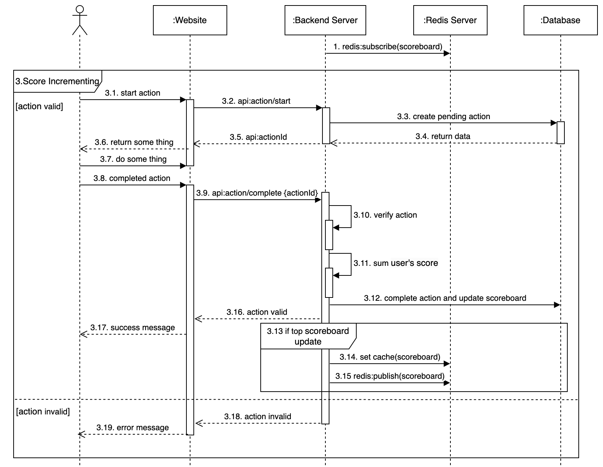

# Problem 6: Architecture
# Scoreboard Module Documents

## Overvie
This module provides a web service for ranking users on the website scoreboard. Users can increase their scores by completing actions. It ensures that malicious users cannot increase scores without authorization.
## Features
- Live Scoreboard Updates: Displays the top 10 users' scores in real-time.
- Score Incrementing: Users earn scores by completing actions, and each action is verified. Each action has a unique identifier.
- Anti-Cheating Mechanism: Limits actions and scores within a time frame.

## Technical Requirements (Assumption: 1M users)
- Load Balancing for multiple instances of backend servers.
- Backend: NodeJS, suggested NestJS framework supports modular architecture, dependency injection, PostgreSQL integration with TypeORM, Redis caching, WebSocket communication, and secure authentication using JWT.
- Database: PostgreSQL for storing action scores and users' total scores, Redis for caching the scoreboard.
- Real-time Communication: WebSocket for live scoreboard updates, Redis Pub/Sub for updating the latest scoreboard for all clients of an instance.
- Security: API authentication using JWT, rate limiting.

## Database tables

### table actions: 
- id: Identifier for the action.
- code: Used to define and manage different types of actions.
- score: Tracks the total score contributed by this action.
- status: Manages the progress of the action.
- user_id: References the user.
### table scoreboards:
- user_id: References the user.
- score: Used for ranking users based on their total score.
## Sequence Diagram
### Live Scoreboard Updates

### Score Incrementing

## Work flow explanation
1. redis:subscribe(scoreboard): Redis subscribes to the 'scoreboard' channel.
- Given 1M users, we need to scale with multiple backend instances.
- When the scoreboard changes, we need to broadcast the latest data to all clients.
- Using Redis Publish/Subscribe to update the scoreboard across all backend instances and broadcast the updates to clients.

2. WebSocket streaming: Live Scoreboard Updates
- 2.3. ws:subscribe(scoreboard): When user open the Scoreboard, we need to connect the WebSocket and send subscribe event to get the first Scoreboard data
- 2.4. getScoreboard: Server use Redis to cache Scoreboard. If no cache it will be query Scoreboard on Database and send to client and set cache again.
- 2.11. ws:send(scoreboard): Server send the first Scoreboard data to client.
- 2.14. redis:receive(scoreboard): Server receive the latest Scoreboard data 
- 2.15. ws:send(scoreboard): Server send the latest Scoreboard data to all client
- 2.16. update Scoreboard: Frontend update UI

3. Score Incrementing: 
- step 1: Client call api POST: action/start to create new aciton valid and return actionId, If request reach to rate limmit and limit of action then reject.
- step 2: Client able to use this actionId to do some thing.
- step 3: Client call api POST: action/complete with actionId to update action is complete, update scoreboard.
- step 4: Check if the top rank on the scoreboard changes, then update the cache and publish a message to the Redis channel.
- step 5: Response result of update to client.

## API describe 
### API start action
- endpoint: /action/start
- method: POST
- headers: { "Content-Type": "application/json", "timestamp": number }
- body: { "action": string }
- response: {  "status": boolean, "message": string, "actionId": number }

### API complete action
- endpoint: /action/complete
- method: POST
- headers: { "Content-Type": "application/json", "timestamp": number }
- body: { "actionId": number }
- response: { "status": boolean, "message": string }
